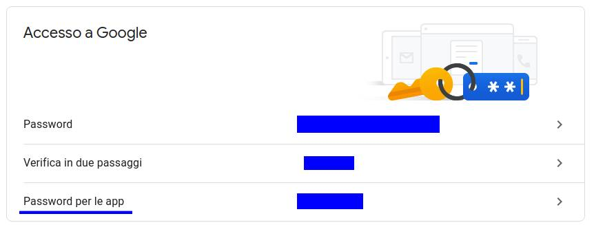

# Mail sender
Questo è uno script che permette di fare la stampa unione con la mail di google.
Questo script è stato realizzato per un contest.

## Prima esecuzione
Per eseguire questo script bisogna svolgere tutti questi passaggi:
- Create una password per app esterne che permette allo script di collegarsi all'account del mittente ([link](https://myaccount.google.com/security?rapt=AEjHL4MbGEoWlakBM55Kv8XTcOfZgPpiF0sn6LbXOMjRPYj9pFnk5933vhH9gJGVxa0BcDmwzu1WkRwGq5kwX7oUVX-KqCwEbg)).
Cliccate la sezione sottolineata e svolgete tutti i passaggi per la creazione della password.


- Copiate la password appena creata nella variabile *password* a riga 59.
```python
# external app password is required to access to the sender account
password = 'password da genereare https://myaccount.google.com/security?rapt=AEjHL4MbGEoWlakBM55Kv8XTcOfZgPpiF0sn6LbXOMjRPYj9pFnk5933vhH9gJGVxa0BcDmwzu1WkRwGq5kwX7oUVX-KqCwEbg' 
context = ssl.create_default_context()
```
- Modificate il file contacts.json sostituendo *recieverEmail* con la mail del destinatario:
```json
[
    {"Mail": "recieverEmail", "Attached": "ciao.jpg", "nome": "Aurora",  "numero": "33333333"}
]
```
- Modificate il file format.json sostituendo *senderEmail* con la mail del mittente:
```json
{
    "From":"senderEmail",
    "Subject":"...",
    "Message":"..."
}
```
Una volta fatti questi passaggi lo script può eseguito.
## Funzionamento dello script
Il funzionamento dello script si basa sui file *contacts.json* e *format.json*. Il primo si occupa di salvare tutte le informazioni sui contatti ai quali inviare le mail, il secondo si occupa di salvare il messaggio base. Ricorda che questi sono file json quindi devono rispettare la sintassi json.
### Format.json
In questo file vengono racchiuse le informazioni principali del messaggio:
- **Mail**: email del mittente che vuole mandare i messaggi.
- **Subject**: oggetto del messaggio.
- **Message**: messaggio testuale della mail con eventuali *tag*. 
Per inserire dei *tag* nel testo del messaggio si utilizza la seguente sintassi:
```
/*< nomeTag >*/
```
I tag servono per sostituirli con del testo che deve essere diverso per ogni destinatario (ex: nome del destinatario). Il valore dei tag deve essere specificato nel file *contats.json*.
### Contats.json
In questo file vengono racchiuse le informazioni di ogni destinatario. Il file è organizzato come un array di mail, per ognuna si specifica la mail del destinatario, l'eventuale allegato che può essere omesso (L'allegato va inserito nella cartella *Attached*) e tutti i nomi dei tag che sono stati inseriti nel messaggio in format.json con il loro relativo valore. 
Per esempio:
```json
[
    {"Mail": "mario.rossi@gmail.com", "Attached": "ciao.jpg", "nome": "Mario",  "numero": "33333333"}
]
```
Questo specifica un mail da inviare a mario.rossi@gmail.com, con l'allegato ciao.jpg. I tag `/*<nome>*/` e `/*<numero>*/` presenti nel messaggio verranno sostituiti con Mario e 33333333. Il campo *Attached* è l'unico facoltativo, infatti si possono inviare mail prive di allegati.
**Ricorda**: se dovessi specificare dei tag all'interno del messaggio, sei obbligato a specificare il valore del tag per ogni destinatario altrimenti la mail non verrà inviata.
## Allegati
Questo script può inviare allegati, ipoteticamente si possono mandare qualsiasi tipologia di file (come da esempio). Non ho potuto testare l'invio di file troppo pesanti, cosa che potrebbe generare errori. Consiglio in questo caso di inviare a se stessi una mail di prova.